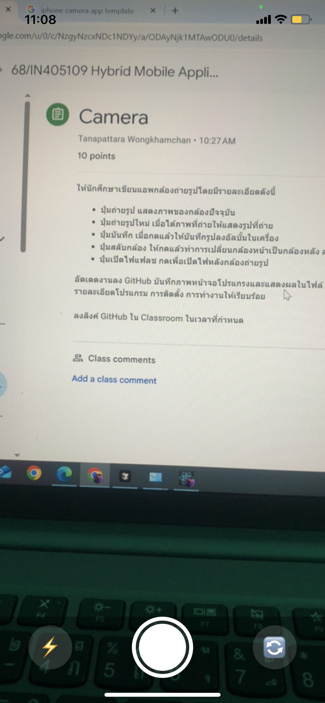

# Camera App

แอปกล้องถ่ายรูป Hybrid Mobile Application (React Native + Expo)

## คุณสมบัติ
- ปุ่มถ่ายรูป แสดงภาพของกล้องปัจจุบัน
- ปุ่มถ่ายรูปใหม่ เมื่อได้ภาพที่ถ่ายให้แสดงรูปที่ถ่าย
- ปุ่มบันทึก เมื่อกดแล้วให้บันทึกรูปลงอัลบั้มในเครื่อง
- ปุ่มสลับกล้อง ให้กดแล้วทำการเปลี่ยนกล้องหน้าเป็นกล้องหลัง สลับกัน
- ปุ่มเปิดไฟแฟลช กดเพื่อเปิดไฟหลังกล้องถ่ายรูป (แฟลชวาบตอนถ่ายรูป)

## วิธีติดตั้ง
1. ติดตั้ง Node.js และ npm
2. ติดตั้ง Expo CLI
   ```bash
   npm install -g expo-cli
   ```
3. clone โปรเจกต์นี้
   ```bash
   git clone <repo-url>
   cd camera-app
   ```
4. ติดตั้ง dependencies
   ```bash
   npm install
   ```
5. รันแอป
   ```bash
   expo start
   ```
6. สแกน QR code ด้วยแอป Expo Go (บนมือถือจริง)

## วิธีใช้งาน
- เปิดแอป จะขออนุญาตกล้องและอัลบั้มภาพ
- กดปุ่ม ⚡️ เพื่อเปิด/ปิดแฟลช (แฟลชจะวาบตอนถ่ายรูป)
- กดปุ่มวงกลมใหญ่เพื่อถ่ายรูป
- กดปุ่ม 🔄 เพื่อสลับกล้องหน้า/หลัง
- เมื่อถ่ายรูปแล้ว สามารถบันทึกลงอัลบั้ม หรือถ่ายใหม่ได้

## ภาพหน้าจอโปรแกรม



---

> **หมายเหตุ:**
> - ทดสอบบนมือถือจริงเท่านั้น (Simulator/Emulator ใช้กล้องไม่ได้)
> - ฟีเจอร์แฟลชจะวาบเฉพาะตอนถ่ายรูป (expo-camera limitation)
